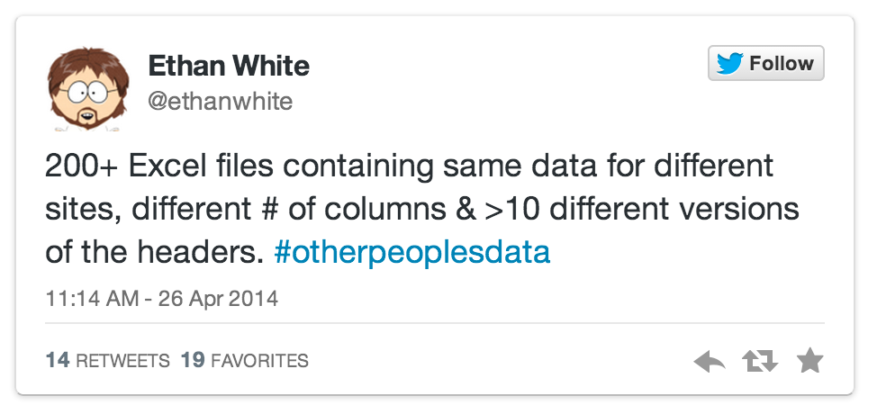

```{r setup, include = FALSE}
knitr::opts_chunk$set(comment = "", cache = TRUE)
```

<!----------------------------slide boundary--------------------------------->
## Workshop logistics

* Etherpad [[link here]]
* Red and Green Stickies

<!----------------------------slide boundary--------------------------------->
## Packages installed?

```{r, eval=FALSE}
install.packages("vegan", dependencies = TRUE)
install.packages("plyr")
install.packages("reshape2")
```

<!----------------------------slide boundary--------------------------------->
## Introduction to **vegan**

* What is it?
* Who developed it?
* How does it differ from other alternatives?

<!----------------------------slide boundary--------------------------------->
## Digging in | Prepping your data for R and vegan

### “The purpose of computing is insight, not numbers” 
### - Richard Hamming 

<!----------------------------slide boundary--------------------------------->
## Digging in | Prepping your data for R and vegan

We've all heard data horror stories


<!----------------------------slide boundary--------------------------------->
## Cleaning your data for import into R for use in vegan

* Spreadsheet example

<!----------------------------slide boundary--------------------------------->
## Cleaning your data for import into R for use in vegan

* We will use built-in datasets for species `varespec` and environmental variables `varechem`
    * from: Väre, H., Ohtonen, R. and Oksanen, J. (1995)

```{r, results='hide'}
library("vegan")
data(varespec)
data(varechem)
```

<!----------------------------slide boundary--------------------------------->
## Cleaning your data for import into R for use in vegan

* We will use built-in datasets for species `varespec` and environmental variables `varechem`
    * from: Väre, H., Ohtonen, R. and Oksanen, J. (1995)

```{r, results='hide'}
library("vegan")
data(varespec)
data(varechem)
```

```{r}
head(varespec[,1:8], n = 3)
```

<!----------------------------slide boundary--------------------------------->
## Summarizing data with `apply()` | sums and sorting

**Sum of rows**
```{r}
sum.of.rows <- apply(varespec, 1, sum)
sort(sum.of.rows, decreasing = TRUE)[1:8] #top 8 rows (sites) 
```

<!----------------------------slide boundary--------------------------------->
## Summarizing data with `apply()` | sums and sorting

**Sum of rows**
```{r}
sum.of.rows <- apply(varespec, 1, sum)
sort(sum.of.rows, decreasing = TRUE)[1:8] #top 8 rows (sites) 
```
**Sum of columns**
```{r}
sum.of.columns <- apply(varespec, 2, sum)
sort(sum.of.columns, decreasing = TRUE)[1:8] #top 8 columns (species)
```

<!----------------------------slide boundary--------------------------------->
## Summarizing data with `apply()` | sums and sorting

**Number of plots in which each spp. occurs**
```{r}
spec.pres <- apply(varespec > 0, 2, sum) 
sort(spec.pres, decreasing = TRUE)[1:18]
```

<!----------------------------slide boundary--------------------------------->
## Basic data transformation

**Square root transformation**
```{r}
head(varespec[,1:8], n = 3)
```

<!----------------------------slide boundary--------------------------------->
## Basic data transformation

**Square root transformation**
```{r}
head(varespec[,1:8], n = 3)
spec.sqrt <- sqrt(varespec)
head(spec.sqrt[,1:8], n = 3)
```

<!----------------------------slide boundary--------------------------------->
## Data transformation with `decostand()`

**Total**
```{r}
head(varespec[,1:8], n = 3)
```

<!----------------------------slide boundary--------------------------------->
## Data transformation with `decostand()`

**Total**
```{r}
head(varespec[,1:8], n = 3)
spec.total <- decostand(varespec, method = "total", MARGIN = 1) # by rows (sites)
head(spec.total[,1:8], n = 3)
```

<!----------------------------slide boundary--------------------------------->
## Data transformation with `decostand()`

**Maximum**
```{r}
head(varespec[,1:8], n = 3)
```

<!----------------------------slide boundary--------------------------------->
## Data transformation with `decostand()`

**Maximum** 
```{r}
head(varespec[,1:8], n = 3)
spec.max <- decostand(varespec, method = "max", MARGIN = 2) # by columns (species)
head(spec.max[,1:8], n = 3)
```

<!----------------------------slide boundary--------------------------------->
## Data transformation with `decostand()`

**Presence-Absence**
```{r}
head(varespec[,1:8], n = 3)
```

<!----------------------------slide boundary--------------------------------->
## Data transformation with `decostand()`

**Presence-Absence**
```{r}
head(varespec[,1:8], n = 3)
spec.pa <- decostand(varespec, method = "pa")
head(spec.pa[,1:8], n = 3)
```

<!----------------------------slide boundary--------------------------------->
## Data transformation with `decostand()`

**Hellinger (Legendre & Gallagher 2001)**
Square root of method "total"
```{r}
head(varespec[,1:8], n = 3)
```

<!----------------------------slide boundary--------------------------------->
## Data transformation with `decostand()`

**Hellinger (Legendre & Gallagher 2001)**
Square root of method "total"
```{r}
head(varespec[,1:8], n = 3)
spec.hellinger <- decostand(varespec, method = "hellinger", MARGIN = 1) # on rows (sites)
head(spec.hellinger[,1:8], n = 3)
```

<!----------------------------slide boundary--------------------------------->
## Data transformation with `decostand()`

**Wisconsin double standardization**  
Species standardized to maximum, then sites by totals.  
```{r}
head(varespec[,1:8], n = 3)
```

<!----------------------------slide boundary--------------------------------->
## Data transformation with `decostand()`

**Wisconsin double standardization**  
Species standardized to maximum, then sites by totals.
```{r}
head(varespec[,1:8], n = 3)
spec.wisc <- wisconsin(varespec)
head(spec.wisc[,1:8], n = 3)
```

<!----------------------------slide boundary--------------------------------->
## Types of distance metrics | and why you might want to use one instead of another

* Presence/absence
* Abundance based
* Probabilistic

## Calculating community distances with `vegdist()` | so many distance metrics, so little time!

Examples: 

* Bray
* Jaccard
* Morisita
* How to choose a good one for your data set?
    * `rankindex()`

## Rarefaction

## Within vs between group similarities

* `betadisper()`

## References
