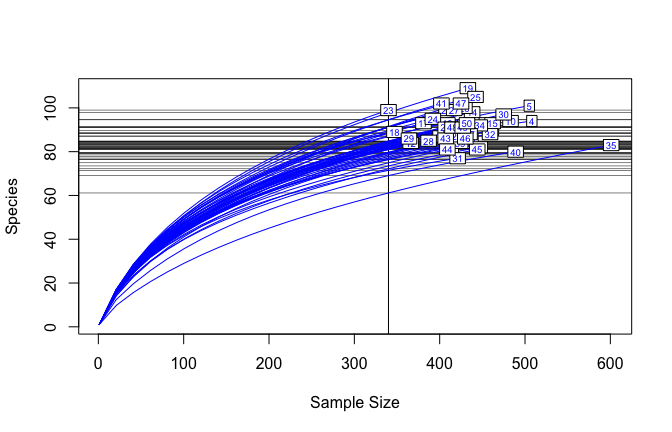

# Community data analysis using the vegan package in R
Naupaka Zimmerman and Gavin Simpson  
August 9, 2014 • ESA 2014  


<!----------------------------slide boundary--------------------------------->

## Workshop logistics

* Etherpad 
    * https://etherpad.mozilla.org/ESA2014-vegan

<!----------------------------slide boundary--------------------------------->

## Workshop logistics

* Etherpad 
    * https://etherpad.mozilla.org/ESA2014-vegan
* Red and Green Stickies 
  
&nbsp;&nbsp;&nbsp;&nbsp;

<!----------------------------slide boundary--------------------------------->

## Packages installed?


```r
install.packages("vegan", dependencies = TRUE)
install.packages("plyr")
install.packages("reshape2")
```

### Data downloaded from github?  
https://github.com/naupaka/esa_vegan

<!----------------------------slide boundary--------------------------------->

## Introduction to **vegan**

* What is it?
* Who developed it?
* How does it differ from other alternatives?

<!----------------------------slide boundary--------------------------------->

# Cleaning and importing data

<!----------------------------slide boundary--------------------------------->

## Digging in | Prepping your data for R and vegan

### “The purpose of computing is insight, not numbers” 
### - Richard Hamming 

<!----------------------------slide boundary--------------------------------->

## Digging in | Prepping your data for R and vegan

### “The purpose of computing is insight, not numbers” 
### - Richard Hamming 
<br /><br /><br />
But you have to get through the numbers to get to the insight...

<!----------------------------slide boundary--------------------------------->

## Digging in | Prepping your data for R and vegan

We've all heard data horror stories


<!----------------------------slide boundary--------------------------------->

## Cleaning your data for R and vegan

### Loading dirty data and then cleaning

```r
setwd("your/working/directory/")
BCI.small.csv.in <- read.csv("data/BCI_small.csv", header = TRUE, row.names = 1)
```

<!----------------------------slide boundary--------------------------------->

## Cleaning your data for R and vegan

### Loading dirty data and then cleaning

```r
BCI.small.csv.in <- read.csv("data/BCI_small_fixed.csv", header = TRUE, row.names = 1)
```

<!----------------------------slide boundary--------------------------------->

## Cleaning your data for R and vegan

Then...  

```r
head(BCI.small.csv.in, n=3)
```

```
  Abarema.macradenium Acacia.melanoceras Acalypha.diversifolia
1                   0                  1                     0
2                   1                  0                     0
3                   0                  0                     0
  Acalypha.macrostachya Adelia.triloba
1                     0              0
2                     0              0
3                     1              0
```

<!----------------------------slide boundary--------------------------------->

## Cleaning your data for R and vegan

Then...  

```r
summary(BCI.small.csv.in)
```

```
 Abarema.macradenium Acacia.melanoceras Acalypha.diversifolia
 Min.   :0.0         Min.   :0.00       Min.   :0.0          
 1st Qu.:0.0         1st Qu.:0.00       1st Qu.:0.0          
 Median :0.0         Median :0.00       Median :0.0          
 Mean   :0.3         Mean   :0.25       Mean   :0.3          
 3rd Qu.:0.0         3rd Qu.:0.25       3rd Qu.:0.0          
 Max.   :2.0         Max.   :1.00       Max.   :3.0          
 Acalypha.macrostachya Adelia.triloba
 Min.   :0.00          Min.   :0.0   
 1st Qu.:0.00          1st Qu.:0.0   
 Median :0.00          Median :0.0   
 Mean   :0.05          Mean   :0.8   
 3rd Qu.:0.00          3rd Qu.:1.0   
 Max.   :1.00          Max.   :5.0   
```

<!----------------------------slide boundary--------------------------------->

## Cleaning your data for R and vegan

We will now switch to using one of vegan's built-in datasets for species (`BCI`) and environmental variables from the same paper, which we will load directly
    
* from Condit et al. 2002 *Science*


```r
library("vegan")
data(BCI)
BCI.env <- read.csv("data/BCI.env.csv", header = TRUE, row.names = 1)
```

<!----------------------------slide boundary--------------------------------->

## Cleaning your data for R and vegan

We will now switch to using one of vegan's built-in datasets for species (`BCI`) and environmental variables from the same paper, which we will load directly
    
* from Condit et al. 2002 *Science*


```r
library("vegan")
data(BCI)
BCI.env <- read.csv("data/BCI.env.csv", header = TRUE, row.names = 1)
```


```r
head(BCI[,1:3], n = 3)
```

```
  Abarema.macradenium Acacia.melanoceras Acalypha.diversifolia
1                   0                  0                     0
2                   0                  0                     0
3                   0                  0                     0
```

<!----------------------------slide boundary--------------------------------->

# Basic data summarizing

<!----------------------------slide boundary--------------------------------->

## Summarizing data with `apply()` | sums and sorting

**Sum of rows**

```r
sum.of.rows <- apply(BCI, 1, sum)
sort(sum.of.rows, decreasing = TRUE)[1:8] #top 8 rows (plots) 
```

```
 35   4   5  40  10  30   3  15 
601 508 505 489 483 475 463 462 
```

<!----------------------------slide boundary--------------------------------->

## Summarizing data with `apply()` | sums and sorting

**Sum of rows**

```r
sum.of.rows <- apply(BCI, 1, sum)
sort(sum.of.rows, decreasing = TRUE)[1:8] #top 8 rows (plots) 
```

```
 35   4   5  40  10  30   3  15 
601 508 505 489 483 475 463 462 
```
**Sum of columns**

```r
sum.of.columns <- apply(BCI, 2, sum)
sort(sum.of.columns, decreasing = TRUE)[1:3] #top 3 columns (species)
```

```
 Faramea.occidentalis Trichilia.tuberculata      Alseis.blackiana 
                 1717                  1681                   983 
```

<!----------------------------slide boundary--------------------------------->

## Summarizing data with `apply()` | sums and sorting

**Number of plots in which each spp. occurs**

```r
spec.pres <- apply(BCI > 0, 2, sum) 
sort(spec.pres, decreasing = TRUE)[1:18]
```

```
       Alseis.blackiana    Faramea.occidentalis       Hirtella.triandra 
                     50                      50                      50 
      Oenocarpus.mapora     Protium.tenuifolium Tetragastris.panamensis 
                     50                      50                      50 
  Trichilia.tuberculata           Apeiba.aspera        Gustavia.superba 
                     50                      49                      49 
    Pouteria.reticulata  Quararibea.asterolepis           Randia.armata 
                     49                      49                      49 
    Brosimum.alicastrum       Cordia.lasiocalyx     Eugenia.oerstedeana 
                     48                      48                      48 
        Guarea.guidonia    Hasseltia.floribunda      Heisteria.concinna 
                     48                      48                      48 
```

<!----------------------------slide boundary--------------------------------->

# Data Transformation

<!----------------------------slide boundary--------------------------------->

## Basic data transformation

**Square root transformation**

```r
head(BCI[,162:164], n = 3)
```

```
  Prioria.copaifera Protium.costaricense Protium.panamense
1                13                    5                 2
2                12                    4                 0
3                12                    1                 2
```

<!----------------------------slide boundary--------------------------------->

## Basic data transformation

**Square root transformation**

```r
head(BCI[,162:164], n = 3)
```

```
  Prioria.copaifera Protium.costaricense Protium.panamense
1                13                    5                 2
2                12                    4                 0
3                12                    1                 2
```

```r
spec.sqrt <- sqrt(BCI)
head(spec.sqrt[,162:164], n = 3)
```

```
  Prioria.copaifera Protium.costaricense Protium.panamense
1             3.606                2.236             1.414
2             3.464                2.000             0.000
3             3.464                1.000             1.414
```

<!----------------------------slide boundary--------------------------------->

## Data transformation in vegan with `decostand()`

**Total**

```r
head(BCI[,162:164], n = 3)
```

```
  Prioria.copaifera Protium.costaricense Protium.panamense
1                13                    5                 2
2                12                    4                 0
3                12                    1                 2
```

<!----------------------------slide boundary--------------------------------->

## Data transformation in vegan with `decostand()`

**Total**

```r
head(BCI[,162:164], n = 3)
```

```
  Prioria.copaifera Protium.costaricense Protium.panamense
1                13                    5                 2
2                12                    4                 0
3                12                    1                 2
```

```r
spec.total <- decostand(BCI, method = "total", MARGIN = 1) # by rows (sites)
head(spec.total[,162:164], n = 3)
```

```
  Prioria.copaifera Protium.costaricense Protium.panamense
1           0.02902             0.011161          0.004464
2           0.02759             0.009195          0.000000
3           0.02592             0.002160          0.004320
```

<!----------------------------slide boundary--------------------------------->

## Data transformation in vegan with `decostand()`

**Maximum**

```r
head(BCI[,162:164], n = 3)
```

```
  Prioria.copaifera Protium.costaricense Protium.panamense
1                13                    5                 2
2                12                    4                 0
3                12                    1                 2
```

<!----------------------------slide boundary--------------------------------->

## Data transformation in vegan with `decostand()`

**Maximum** 

```r
head(BCI[,162:164], n = 3)
```

```
  Prioria.copaifera Protium.costaricense Protium.panamense
1                13                    5                 2
2                12                    4                 0
3                12                    1                 2
```

```r
spec.max <- decostand(BCI, method = "max", MARGIN = 2) # by columns (species)
head(spec.max[,162:164], n = 3)
```

```
  Prioria.copaifera Protium.costaricense Protium.panamense
1            0.5000               0.7143               0.5
2            0.4615               0.5714               0.0
3            0.4615               0.1429               0.5
```

<!----------------------------slide boundary--------------------------------->

## Data transformation in vegan with `decostand()`

**Presence-Absence**

```r
head(BCI[,162:164], n = 3)
```

```
  Prioria.copaifera Protium.costaricense Protium.panamense
1                13                    5                 2
2                12                    4                 0
3                12                    1                 2
```

<!----------------------------slide boundary--------------------------------->

## Data transformation in vegan with `decostand()`

**Presence-Absence**

```r
head(BCI[,162:164], n = 3)
```

```
  Prioria.copaifera Protium.costaricense Protium.panamense
1                13                    5                 2
2                12                    4                 0
3                12                    1                 2
```

```r
spec.pa <- decostand(BCI, method = "pa")
head(spec.pa[,162:164], n = 3)
```

```
  Prioria.copaifera Protium.costaricense Protium.panamense
1                 1                    1                 1
2                 1                    1                 0
3                 1                    1                 1
```

<!----------------------------slide boundary--------------------------------->

## Data transformation in vegan with `decostand()`

**Hellinger (Legendre & Gallagher 2001)**
Square root of method "total"

```r
head(BCI[,162:164], n = 3)
```

```
  Prioria.copaifera Protium.costaricense Protium.panamense
1                13                    5                 2
2                12                    4                 0
3                12                    1                 2
```

<!----------------------------slide boundary--------------------------------->

## Data transformation in vegan with `decostand()`

**Hellinger (Legendre & Gallagher 2001)**
Square root of method "total"

```r
head(BCI[,162:164], n = 3)
```

```
  Prioria.copaifera Protium.costaricense Protium.panamense
1                13                    5                 2
2                12                    4                 0
3                12                    1                 2
```

```r
spec.hellinger <- decostand(BCI, method = "hellinger", MARGIN = 1) # on rows (sites)
head(spec.hellinger[,162:164], n = 3)
```

```
  Prioria.copaifera Protium.costaricense Protium.panamense
1            0.1703              0.10564           0.06682
2            0.1661              0.09589           0.00000
3            0.1610              0.04647           0.06572
```

<!----------------------------slide boundary--------------------------------->

## Data transformation in vegan with `decostand()`

**Wisconsin double standardization**  
Shortcut function for standardizing species to maximum, then sites by totals.  

```r
head(BCI[,162:164], n = 3)
```

```
  Prioria.copaifera Protium.costaricense Protium.panamense
1                13                    5                 2
2                12                    4                 0
3                12                    1                 2
```

<!----------------------------slide boundary--------------------------------->

## Data transformation in vegan with `decostand()`

**Wisconsin double standardization**  
Shortcut function for standardizing species to maximum, then sites by totals.

```r
head(BCI[,162:164], n = 3)
```

```
  Prioria.copaifera Protium.costaricense Protium.panamense
1                13                    5                 2
2                12                    4                 0
3                12                    1                 2
```

```r
spec.wisc <- wisconsin(BCI)
head(spec.wisc[,162:164], n = 3)
```

```
  Prioria.copaifera Protium.costaricense Protium.panamense
1           0.01316             0.018798           0.01316
2           0.01532             0.018973           0.00000
3           0.01411             0.004367           0.01528
```

<!----------------------------slide boundary--------------------------------->

# Calculating community distances

<!----------------------------slide boundary--------------------------------->

## Calculating distances with `vegdist()` | so many distance metrics, so little time!

### Many different community distance metrics are available in `vegdist()`    
*manhattan, euclidean, canberra, bray, kulczynski, jaccard, gower, altGower, morisita, horn, mountford, raup, binomial, chao, or cao*

<!----------------------------slide boundary--------------------------------->

## Calculating distances with `vegdist()` | so many distance metrics, so little time!

### Many different community distance metrics are available in `vegdist()`   
*manhattan, euclidean, canberra, bray, kulczynski, jaccard, gower, altGower, morisita, horn, mountford, raup, binomial, chao, or cao*


```r
spec.jaccpa <- vegdist(BCI, method = "jaccard", binary = TRUE)
# returns an object of class 'dist'
str(spec.jaccpa) 
```

```
Class 'dist'  atomic [1:1225] 0.434 0.462 0.442 0.46 0.425 ...
  ..- attr(*, "Size")= int 50
  ..- attr(*, "Labels")= chr [1:50] "1" "2" "3" "4" ...
  ..- attr(*, "Diag")= logi FALSE
  ..- attr(*, "Upper")= logi FALSE
  ..- attr(*, "method")= chr "binary jaccard"
  ..- attr(*, "call")= language vegdist(x = BCI, method = "jaccard", binary = TRUE)
```

<!----------------------------slide boundary--------------------------------->

## Calculating distances with `vegdist()` | so many distance metrics, so little time!


```r
as.matrix(spec.jaccpa)[1:4,1:4]
```

```
       1      2      3      4
1 0.0000 0.4336 0.4622 0.4417
2 0.4336 0.0000 0.4464 0.4386
3 0.4622 0.4464 0.0000 0.4274
4 0.4417 0.4386 0.4274 0.0000
```


<!----------------------------slide boundary--------------------------------->

## Calculating distances with `vegdist()` | so many distance metrics, so little time!

### How to choose a good one for your data set?  
### First step, read the help for vegdist

```r
?vegdist
```

<!----------------------------slide boundary--------------------------------->

## Calculating distances with `vegdist()` | so many distance metrics, so little time!

### Second, try `rankindex()`    
Higher rank correlations indicate better separation along gradients

```r
rank.UTM.NS <- rankindex(BCI.env$UTM.NS, BCI, indices = 
              c("bray", "euclid", "manhattan", "horn"), method = "spearman")
rank.UTM.NS
```

```
     bray    euclid manhattan      horn 
   0.1344    0.1521    0.1727    0.1687 
```

<!----------------------------slide boundary--------------------------------->

## Calculating distances with `vegdist()` | so many distance metrics, so little time!

### Second, try `rankindex()`    
Can also use on standardized data

```r
rank.UTM.NS.wisc <- rankindex(BCI.env$UTM.NS, wisconsin(BCI), indices = 
              c("bray", "euclid", "manhattan", "horn"), method = "spearman")
rank.UTM.NS.wisc
```

```
     bray    euclid manhattan      horn 
  0.12053   0.07631   0.12053   0.12799 
```

<!----------------------------slide boundary--------------------------------->

## Calculating distances with `vegdist()` | comparison


```r
sort(rank.UTM.NS, decreasing = TRUE)
```

```
manhattan      horn    euclid      bray 
   0.1727    0.1687    0.1521    0.1344 
```

```r
sort(rank.UTM.NS.wisc, decreasing = TRUE)
```

```
     horn      bray manhattan    euclid 
  0.12799   0.12053   0.12053   0.07631 
```

<!----------------------------slide boundary--------------------------------->

# Diversity metrics

<!----------------------------slide boundary--------------------------------->

## Alpha diversity

Basic counts of richness for each plot or site

```r
site.richness <- apply(BCI > 0, 1, sum)
site.richness[1:18]
```

```
  1   2   3   4   5   6   7   8   9  10  11  12  13  14  15  16  17  18 
 93  84  90  94 101  85  82  88  90  94  87  84  93  98  93  93  93  89 
```

<!----------------------------slide boundary--------------------------------->

## Alpha diversity | Other metrics

Fisher's alpha

```r
site.fisher <- fisher.alpha(BCI)
site.fisher[1:12]
```

```
    1     2     3     4     5     6     7     8     9    10    11    12 
35.67 30.99 33.32 33.92 37.96 32.49 30.58 33.45 35.67 34.82 34.21 34.12 
```

<!----------------------------slide boundary--------------------------------->

## Alpha diversity | Other metrics

Shannon diversity

```r
site.shannon <- diversity(BCI, index = "shannon", MARGIN = 1)
site.shannon[1:12]
```

```
    1     2     3     4     5     6     7     8     9    10    11    12 
4.018 3.848 3.814 3.977 3.970 3.777 3.837 3.908 3.761 3.890 3.860 3.698 
```

<!----------------------------slide boundary--------------------------------->

## Rarefaction

This is the same as `apply(BCI > 0, MARGIN = 1, sum)`    
it gives the species count for each plot

```r
BCI.S <- specnumber(BCI)
```
This finds the plot with the least number of individuals

```r
# could also use rowsums() instead of apply()
BCI.raremax <- min(apply(BCI, 1, sum))
```

<!----------------------------slide boundary--------------------------------->

## Rarefaction

Rarefy BCI species matrix to the minimum number of individuals in any plot    
and plot the relationship between observed and rarefied counts (plus add 1-1 line)

```r
BCI.Srare <- rarefy(BCI, BCI.raremax)
plot(BCI.S, BCI.Srare, xlab = "Observed No. of Species", ylab = "Rarefied No. of Species")
abline(0, 1)
```

 

<!----------------------------slide boundary--------------------------------->

## Rarefaction

Put it all together

```r
rarecurve(BCI, step = 20, sample = BCI.raremax, col = "blue", cex = 0.6)
```

 

<!----------------------------slide boundary--------------------------------->

## Beta diversity

Multivariate homogeneity of groups dispersions

```r
BCI.bray <- vegdist(BCI, method = "bray")
betadisper(BCI.bray,group = as.factor(BCI.env$UTM.NS))
```

```

	Homogeneity of multivariate dispersions

Call: betadisper(d = BCI.bray, group = as.factor(BCI.env$UTM.NS))

No. of Positive Eigenvalues: 43
No. of Negative Eigenvalues: 6

Average distance to median:
1011568.985 1011668.985 1011768.985 1011868.985 1011968.985 
      0.282       0.266       0.314       0.294       0.334 

Eigenvalues for PCoA axes:
PCoA1 PCoA2 PCoA3 PCoA4 PCoA5 PCoA6 PCoA7 PCoA8 
1.016 0.707 0.532 0.332 0.261 0.251 0.226 0.170 
```

<!----------------------------slide boundary--------------------------------->

## Beta diversity

Boxplot of within-group multivariate dispersion

```r
boxplot(betadisper(BCI.bray,group = as.factor(BCI.env$UTM.NS)))
```

 


<!----------------------------slide boundary--------------------------------->


## References
