# Ordination with vegan
Naupaka Zimmerman and Gavin Simpson  
August 9, 2014 • ESA 2014  


<!----------------------------slide boundary--------------------------------->

# Ordination plots

<!----------------------------slide boundary--------------------------------->

## Unconstrained ordination

**What does it mean?**

* First we look for major variation, then try to attribute it to environmental variation
* vs. constrained ordination, where we only want to see what can be explained by environmental variables of interest

<!----------------------------slide boundary--------------------------------->

## Unconstrained ordination

**What does it mean?**

* First we look for major variation, then try to attribute it to environmental variation
* vs. constrained ordination, where we only want to see what can be explained by environmental variables of interest

**Examples of unconstrained ordination:**

* Correspondance Analysis - CA
* Principal Components Analysis - PCA
* Nonmetric Multidimensional Scaling - NMDS

<!----------------------------slide boundary--------------------------------->

## Unconstrained ordination

**What does it mean?**

* First we look for major variation, then try to attribute it to environmental variation
* vs. constrained ordination, where we only want to see what can be explained by environmental variables of interest

**Examples of unconstrained ordination:**

* Correspondance Analysis - CA
* Principal Components Analysis - PCA
* **Nonmetric Multidimensional Scaling - NMDS**

<!----------------------------slide boundary--------------------------------->

## Before we get started

Housekeeping

```r
setwd("your/working/dir")
```


```r
library("vegan")
data(dune)
data(dune.env)
```
Data from: Jongman, R.H.G, ter Braak, C.J.F & van Tongeren, O.F.R. (1987). Data Analysis in Community and Landscape Ecology. Pudoc, Wageningen.

<!----------------------------slide boundary--------------------------------->

## Before we get started | species


```r
dim(dune)
```

```
[1] 20 30
```

```r
head(dune[,1:10], n=3)
```

```
   Belper Empnig Junbuf Junart Airpra Elepal Rumace Viclat Brarut Ranfla
2       3      0      0      0      0      0      0      0      0      0
13      0      0      3      0      0      0      0      0      0      2
4       2      0      0      0      0      0      0      0      2      0
```

<!----------------------------slide boundary--------------------------------->

## Before we get started | environment


```r
head(dune.env, n=3)
```

```
    A1 Moisture Management      Use Manure
2  3.5        1         BF Haypastu      2
13 6.0        5         SF Haypastu      3
4  4.2        2         SF Haypastu      4
```

```r
summary(dune.env)
```

```
       A1        Moisture Management       Use    Manure
 Min.   : 2.80   1:7      BF:3       Hayfield:7   0:6   
 1st Qu.: 3.50   2:4      HF:5       Haypastu:8   1:3   
 Median : 4.20   4:2      NM:6       Pasture :5   2:4   
 Mean   : 4.85   5:7      SF:6                    3:4   
 3rd Qu.: 5.72                                    4:3   
 Max.   :11.50                                          
```

<!----------------------------slide boundary--------------------------------->

## Basic ordination and plotting

There are two more basic NMDS ordination functions:

* `isoMDS()` from the MASS package
* `monoMDS()` in vegan

Vegan also has a wrapper function for doing NMDS ordinations using best practices:

* `metaMDS()`

This will do handy things like try to standardize your data if necessary and perform rotation, among other things.

<!----------------------------slide boundary--------------------------------->

## Basic ordination and plotting


```r
dune.bray.ord <- metaMDS(dune, distance = "bray", k = 2, trymax = 50)
```

**Show in RStudio**

<!----------------------------slide boundary--------------------------------->

## Basic ordination and plotting (using all defaults)


```r
plot(dune.bray.ord)
```

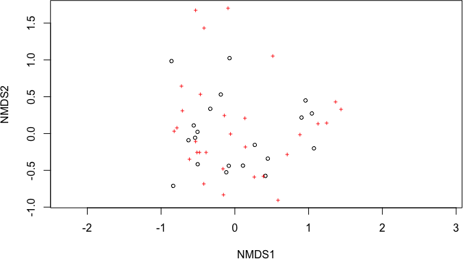 


<!----------------------------slide boundary--------------------------------->

## Basic ordination and plotting (just plots)


```r
plot(dune.bray.ord, display = "sites")
```

 

<!----------------------------slide boundary--------------------------------->

## Basic ordination and plotting (just species)


```r
plot(dune.bray.ord, display = "species")
```

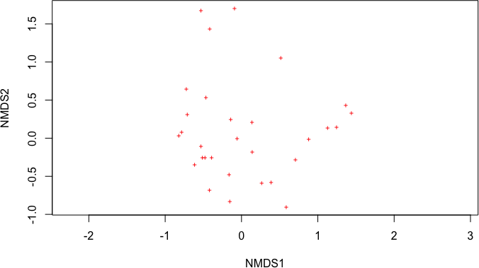 

<!----------------------------slide boundary--------------------------------->

## Site names instead of points


```r
plot(dune.bray.ord, display = "sites", type = "t")
```

 

<!----------------------------slide boundary--------------------------------->

## Site names instead of points


```r
plot(dune.bray.ord, display = "sites")
set.seed(314) ## make reproducible
ordipointlabel(dune.bray.ord, display = "sites", scaling = 3, add = TRUE)
```

 

<!----------------------------slide boundary--------------------------------->

## Site names instead of points


```r
plot(dune.bray.ord, display = "species")
set.seed(314) ## make reproducible
ordipointlabel(dune.bray.ord, display = "species", scaling = 3, add = TRUE)
```

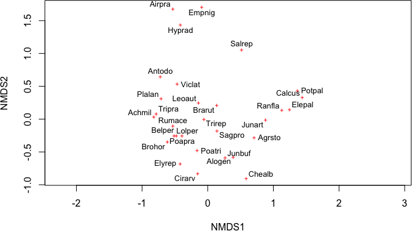 

<!----------------------------slide boundary--------------------------------->

## Site names instead of points


```r
plot(dune.bray.ord)
set.seed(314) ## make reproducible
ordipointlabel(dune.bray.ord, scaling = 3, add = TRUE)
```

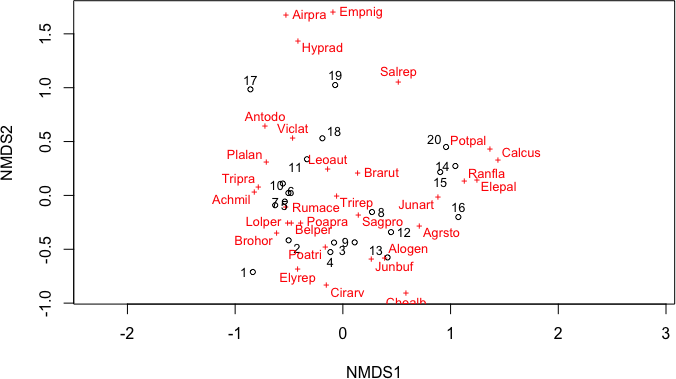 


<!----------------------------slide boundary--------------------------------->

## Larger points


```r
plot(dune.bray.ord, display = "sites", cex=2)
```

 

<!----------------------------slide boundary--------------------------------->

## Modifying the display of the points with environmental data 

* Color
* Shape
* Size

<!----------------------------slide boundary--------------------------------->

## Modifying the color of points {.smaller}

```r
colors.vec <- c("red", "blue", "orange", "grey")
plot(dune.bray.ord, display = "sites", type = "n")
points(dune.bray.ord, display = "sites", cex=2, pch = 21, 
       col = colors.vec[dune.env$Management], 
       bg = colors.vec[dune.env$Management])
legend("topright", legend = levels(dune.env$Management), bty = "n",
                      col = colors.vec, pch = 21, pt.bg = colors.vec)
```

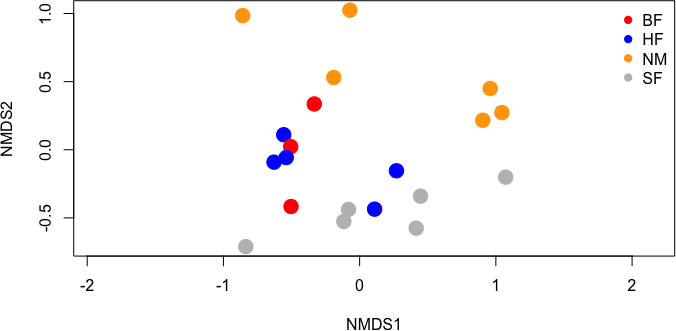 

<!----------------------------slide boundary--------------------------------->

## Modifying the shape of points | pch()
 

<!----------------------------slide boundary--------------------------------->

## Modifying the shape of points {.smaller}

```r
shapes.vec <- c(21, 22, 24)
plot(dune.bray.ord, display = "sites", type = "n")
points(dune.bray.ord, display = "sites", cex=2, bg = "black", 
       pch = shapes.vec[dune.env$Use])
legend("topright", legend = levels(dune.env$Use), bty = "n",
                      col = "black", pch = shapes.vec, pt.bg = "black")
```

 

<!----------------------------slide boundary--------------------------------->

## Modifying the shape and color of points {.smaller}

```r
colors.vec <- c("red", "blue", "orange", "grey")
shapes.vec <- c(21, 22, 24)
plot(dune.bray.ord, display = "sites", type = "n")
points(dune.bray.ord, display = "sites", cex=2, 
       pch = shapes.vec[dune.env$Use], 
       col = colors.vec[dune.env$Management], 
       bg = colors.vec[dune.env$Management])
legend("topright", legend = levels(dune.env$Management), bty = "n",
                      col = colors.vec, pch = 21, pt.bg = colors.vec)
legend(1.4,1.05, legend = levels(dune.env$Use), bty = "n",
                      col = "black", pch = shapes.vec, pt.bg = "black")
```

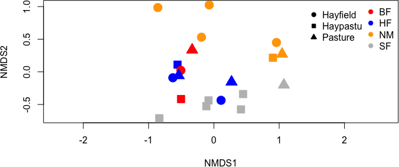 

<!----------------------------slide boundary--------------------------------->

## Adding other layers


```r
# Just points
plot(dune.bray.ord, display = "sites", cex=2)
```

 

<!----------------------------slide boundary--------------------------------->

## Adding other layers


```r
plot(dune.bray.ord, display = "sites", cex=2)
ordihull(dune.bray.ord,groups = dune.env$Management, label = TRUE)
```

 

<!----------------------------slide boundary--------------------------------->

## Adding other layers


```r
plot(dune.bray.ord, display = "sites", cex=2)
ordihull(dune.bray.ord,groups = dune.env$Management, label = TRUE, col = "blue")
```

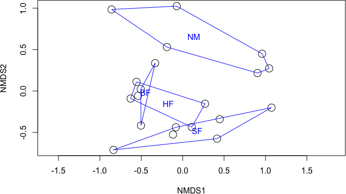 

<!----------------------------slide boundary--------------------------------->

## Adding other layers


```r
plot(dune.bray.ord, display = "sites", cex=2)
ordihull(dune.bray.ord,groups = dune.env$Management, label = TRUE, col = "blue")
ordispider(dune.bray.ord,groups = dune.env$Management, label = TRUE)
```

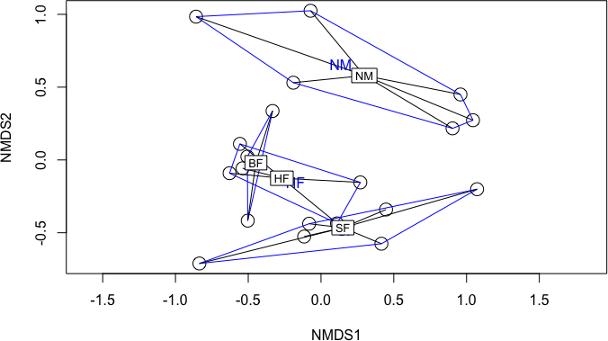 

<!----------------------------slide boundary--------------------------------->

## Adding other layers


```r
# Plot first, then add layers
plot(dune.bray.ord, display = "sites", cex=2)
```

 

<!----------------------------slide boundary--------------------------------->

## Adding other layers


```r
plot(dune.bray.ord, display = "sites", cex=2)
ordispider(dune.bray.ord,groups = dune.env$Management, label = TRUE)
```

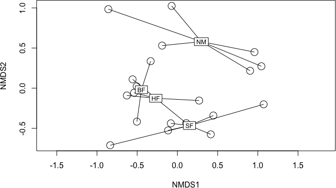 

<!----------------------------slide boundary--------------------------------->

## Adding other layers - axes scaling


```r
plot(dune.bray.ord, type = "n")
```

 

<!----------------------------slide boundary--------------------------------->

## Adding other layers - axes scaling


```r
plot(dune.bray.ord, type = "n")
points(dune.bray.ord,display = "sites", cex = 2)
```

 

<!----------------------------slide boundary--------------------------------->

## Adding other layers - axes scaling


```r
plot(dune.bray.ord, display = "sites", type = "n")
```

 

<!----------------------------slide boundary--------------------------------->

## Adding other layers - axes scaling


```r
plot(dune.bray.ord, display = "sites", type = "n")
points(dune.bray.ord, display = "sites", cex = 2)
```

 

<!----------------------------slide boundary--------------------------------->

## Adding other layers


```r
plot(dune.bray.ord, display = "sites", type = "n")
points(dune.bray.ord,display = "sites", cex = 2)
ordispider(dune.bray.ord,groups = dune.env$Management, label = TRUE)
```

 

<!----------------------------slide boundary--------------------------------->

## Adding other layers


```r
plot(dune.bray.ord, display = "sites", type = "n")
points(dune.bray.ord, display = "sites", cex = 2)
ordiellipse(dune.bray.ord,groups = dune.env$Management, label = TRUE)
```

 

<!----------------------------slide boundary--------------------------------->

## Adding other layers

```r
plot(dune.bray.ord, display = "sites", type = "n")
points(dune.bray.ord,display = "sites", cex = 2)
ordisurf(dune.bray.ord,dune.env$A1, add = TRUE)
```

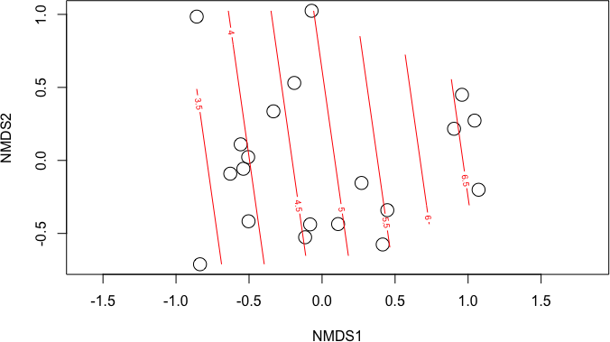 

<!----------------------------slide boundary--------------------------------->

## Vectors in ordination space


```r
dune.bray.ord.A1.fit <- envfit(dune.bray.ord,dune.env$A1, permutations = 1000)
dune.bray.ord.A1.fit
```

```

***VECTORS

     NMDS1 NMDS2   r2 Pr(>r)   
[1,]  0.99  0.14 0.38   0.01 **
---
Signif. codes:  0 '***' 0.001 '**' 0.01 '*' 0.05 '.' 0.1 ' ' 1
P values based on 1000 permutations.
```

<!----------------------------slide boundary--------------------------------->

## Vectors in ordination space


```r
plot(dune.bray.ord, display = "sites", type = "n")
points(dune.bray.ord,display = "sites", cex = 2)
plot(dune.bray.ord.A1.fit, add = TRUE)
ordisurf(dune.bray.ord,dune.env$A1, add = TRUE)
```

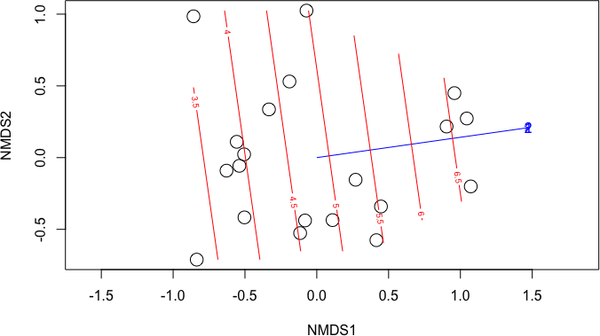 


<!----------------------------slide boundary--------------------------------->

## Activity

Using the cleaned `varespec` data from the last exercise, and based on your finding of an appropriate distance metric:

1. Load the data
2. Create an NMDS plot using `metaMDS()`
    * use the distance metric you chose earlier
        * if this doesn't work, `bray` is a decent fallback
    * Plot only the sites (not the species)
    * Make the points blue squares, size (cex = 2)
    * Add an `ordispider`
    * add a title with `main = "title"`
